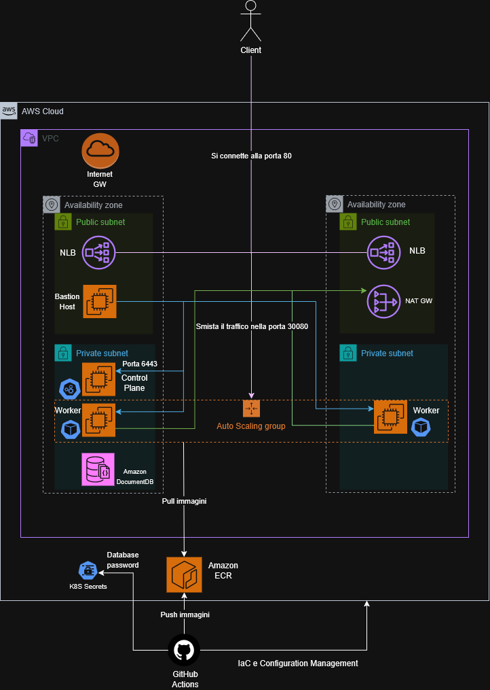

# Obiettivo

Gli obiettivi del progetto sono:
 - Deployare un applicativo $3$-tier in un cluster Kubernetes in cloud, in particolare usando Amazon Web Services (AWS).
 - Realizzare una pipeline GitOps per la gestione dell'infrastruttura e il deployment dell'applicativo, usando GitHub.

### Applicativo

L'applicativo (Easy Polls) è un'applicazione web per la creazione di sondaggi istantanei: un utente crea una domanda con alcune opzioni di risposta, ottiene un link condivisibile, e chiunque abbia il link può votare. I risultati sono visualizzabili in una pagina dedicata, che si aggiorna in tempo reale mostrando le percentuali di voto. L'applicazione è divisa in tre componenti, più il database MongoDB:
 - `frontend`: interfaccia web statica per la creazione dei sondaggi.
 - `poll-service`: espone l'API per la creazione dei sondaggi e la registrazione dei voti.
 - `results-service`: espone l'API per la restituzione dei risultati di un determinato sondaggio.

L'`HorizontalPodAutoscaler` è configurato esclusivamente sul `results-service`, che scala in base all'utilizzo di CPU.

## Architettura Cloud

Lo schema architetturale è il seguente:



I componenti sono i seguenti:
 - **Due subnet private**: collocate in AZ differenti, ospitano i nodi del cluster Kubernetes e l'istanza DocumentDB.
 - **Due subnet pubbliche**: ospitano l'Application Load Balancer, il Bastion Host e il NAT Gateway.
 - **Application Load Balancer**: punto d'ingresso all'applicativo, si occupa di smistare le richieste dei client, in ingresso sulla porta $80$, ai worker del cluster Kubernetes sulla porta $30080$ situati nelle subnet private.
   - La porta $30080$ viene aperta su ogni host dall'Ingress Controller nginx, che si occupa di gestire le richieste HTTP e mapparle al Service corretto.
 - **NAT Gateway e Internet Gateway**: permettono ai worker del cluster di uscire in Internet per scaricare le immagini dei container e i pacchetti. L'Internet Gateway consente inoltre la comunicazione con il Bastion Host.
 - **Bastion Host**: consente di comunicare con il cluster Kubernetes senza esporre l'API all'esterno. Permette inoltre di effettuare l'accesso SSH ai nodi situati nelle subnet private.
 - **Auto Scaling Group**: il cluster Kubernetes è realizzato mediante istanze EC2; in particolare, i worker si trovano in auto scaling (situato in due AZ differenti), permettendo lo scaling dinamico in relazione all'utilizzo di CPU medio. 
 - **Amazon DocumentDB**: il database MongoDB viene gestito totalmente da AWS utilizzando il servizio DocumentDB, collocato nelle due subnet private situate in AZ distinte.
 - **Amazon ECR**: la memorizzazione delle immagini dei container è delegata a ECR, che è del tutto gestito da AWS.

Il provisioning e la configurazione dell'infrastruttura è delegata alle GitHub Actions, come anche la gestione dei segreti quali la password di accesso al database, che verrà successivamente memorizzata nei segreti di Kubernetes.

## Struttura della repository

```
├── ansible
│   ├── bastion-host.yml
│   └── control-plane.yml
├── cloud_architecture_schema.png
├── init_backend.sh
├── scaling_test.py
└── terraform
    ├── document_db.tf
    ├── ec2.tf
    ├── ecr.tf
    ├── iam.tf
    ├── network.tf
    ├── alb.tf
    ├── outputs.tf
    ├── providers.tf
    ├── security_groups.tf
    ├── templates
    │   ├── inventory.tpl
    │   └── node-user-data.sh.tpl
    └── variables.tf
```

### Directory terraform

La directory `terraform` contiene i file Terraform di IaC per la creazione dell'infrastruttura. In particolare:
 - `document_db.tf`: si occupa della creazione di un cluster di DocumentDB collocato in una Subnet Group equivalente alle due subnet private presenti nell'architettura, con una singola istanza attiva.
 - `ec2.tf`: si occupa della creazione di tutte le istanze EC2 presenti nell'architettura, ossia AutoScaling Group con Launch Template e AutoScaling Policy, Control Plane e Bastion Host.
 - `ecr.tf`: si occupa della creazione delle repository ECR per il `frontend`, `poll-service` e `results-service`. Viene definita una policy che mantiene unicamente le ultime $10$ immagini.
 - `iam.tf`: si occupa della creazione di ruoli IAM per permettere alle istanze EC2 di interagire con le API di AWS senza la necessità di inserire credenziali per autenticarsi. Vengono creati i ruoli:
   - Per il Control Plane viene creato il ruolo `easy-polls-control-plane-role`, che permette di effettuare `ssm:GetParameter` e `ssm:PutParameter` del join command su Amazon SSM per far unire i worker al cluster Kubernetes.
   - Per i worker viene creato il ruolo `easy-polls-workers-role`, che permette di effettuare `ssm:GetParameter` del join command su Amazon SSM per unirsi al cluster Kubernetes, e `ecr:GetAuthorizationToken`, `ecr:BatchCheckLayerAvailability`, `ecr:GetDownloadUrlForLayer`, `ecr:BatchGetImage` permettono ai worker di autenticarsi con registry e scaricare le immagini.
   - Per il Bastion Host viene creato il ruolo `easy-polls-bastion-role`, che permette di effettuare `ssm:GetParameter` del kubeconfig per poter interagire con il cluster Kubernetes. 
 - `network.tf`: si occupa della creazione della VPC (`10.0.0.0/16`) e dell'intera topologia di rete, ossia due subnet pubbliche e due subnet private distribuite su due AZ differenti, l'Internet Gateway, il NAT Gateway (con il relativo Elastic IP) e le due route table.
   - La route table pubblica instrada il traffico diretto all'esterno (`0.0.0.0/0`) verso l'Internet Gateway, ed è associata alle subnet pubbliche.
   - La route table privata instrada il traffico diretto all'esterno verso il NAT Gateway, ed è associata alle subnet private.
 - `alb.tf`: si occupa della creazione dell'Application Load Balancer, collocato nelle due subnet pubbliche, e dei componenti a esso associati, ossia un listener TCP sulla porta $80$ e un target group che punta ai nodi worker sulla porta $30080$, ossia la NodePort su cui è in ascolto l'Ingress Controller.
 - `outputs.tf`: si occupa della generazione del file di inventario `hosts.ini` a partire dal template `inventory.tpl`, popolandolo con gli indirizzi IP effettivi delle istanze appena create.
 - `providers.tf`: definisce il provider AWS e configura il backend remoto S3 per il salvataggio dello stato di Terraform, con meccanismo di locking basato su una tabella DynamoDB. Il bucket S3 e la tabella DynamoDB devono esistere prima della prima esecuzione e possono essere create attraverso lo script `init_backend.sh`.
 - `security_groups.tf`: si occupa della creazione dei Security Group che regolano il traffico all'interno dell'infrastruttura. In particolare:
   - `easy-polls-alb-sg`: consente il traffico HTTP in ingresso sulla porta $80$ da qualunque indirizzo, e in uscita unicamente verso i nodi del cluster sulla porta $30080$.
   - `easy-polls-bastion-sg`: consente l'accesso SSH in ingresso sulla porta $22$.
   - `easy-polls-node-sg`: consente in ingresso il traffico sulla porta $30080$ unicamente proveniente dal Security Group dell'Application Load Balancer, e le porte $22$ (SSH) e $6443$ (API server) unicamente dal Security Group del Bastion Host. È inoltre presente una regola *self-referencing* che consente tutto il traffico tra i nodi del cluster, necessaria al funzionamento dei componenti interni di Kubernetes (API server, kubelet, etcd, overlay di rete di Flannel, intervallo delle NodePort).
   - `easy-polls-docdb-sg`: consente il traffico in ingresso sulla porta $27017$ unicamente dal Security Group dei nodi.
   - I Security Group si referenziano reciprocamente anziché tramite indirizzi IP, rendendoli indipendenti dagli indirizzi effettivi delle istanze che sono regolate dall'AutoScaling Group.

È inoltre presente la sotto-directory `terraform/templates`, che contiene:
 - `inventory.tpl` template da cui viene creato l'inventario `hosts.ini` utilizzato da Ansible per eseguire i playbook.
 - `node-user-data.sh.tpl` template da cui viene creato l'userdata passato ai worker del cluster. Poiché essi vengono gestiti totalmente dall'AutoScaling Group, l'installazione e la configurazione di alcuni componenti di Kubernetes devono essere delegati all'userdata e non ad Ansible, in quanto alcune istanze potrebbero nascere dopo l'esecuzione dei playbook in base alle necessità.

### Directory ansible

La directory `ansible` contiene i file Ansible di Configuration Management per la configurazione del Control Plane e del Bastion Host. È importante osservare che, a differenza dell'infrastruttura locale, **i worker non compaiono nell'inventario e non vengono configurati da Ansible** perché vengono distrutti e creati dinamicamente dall'AutoScaling Group: un nodo creato in seguito a un evento di scaling non esisterebbe nel momento in cui i playbook vengono eseguiti, e non potrebbe quindi essere configurato; l'installazione dei prerequisiti per Kubernetes è quindi delegata all'**userdata**.\
Inoltre, poiché il Control Plane risiede in una subnet privata, Ansible lo raggiunge attraverso il Bastion Host mediante un `ProxyCommand` configurato direttamente nell'inventario generato da Terraform. I playbook sono i seguenti:
 - `control-plane.yml`: si occupa dell'inizializzazione del cluster Kubernetes e dell'installazione dei suoi componenti di sistema. In particolare, attende il completamento di `cloud-init`, ossia dell'userdata, in modo da garantire che i prerequisiti di Kubernetes siano stati installati prima di procedere, installa Helm e la Flannel CNI, Metrics Server e Ingress Nginx, oltre generare il join command e pubblicarlo su Amazon SSM.
 - `bastion-host.yml`: si occupa di configurare il Bastion Host installando l'AWS CLI e kubectl, scaricando il `kubeconfig` da Amazon SSM e verificando infine che il cluster sia effettivamente raggiungibile.

### Workflows

La directory `.github/workflows` contiene i workflow che realizzano la pipeline GitOps per la gestione dell'infrastruttura. Tutti i job si autenticano ad AWS tramite OIDC, assumendo un ruolo IAM dedicato. In particolare, sono presenti due workflow:
 - `provision_infra.yml`: contiene quattro job:
    - `plan`: si attiva solo a seguito di una pull request e si occupa di inserire il piano Terraform nei commenti.
    - `provision`: si occupa del provisioning dell'infrastruttura tramite `tofu apply`. Al termine, l'inventario `hosts.ini` generato da Terraform e gli output vengono salvati come artifact.
    - `configure`: si occupa della configurazione del cluster tramite l'esecuzione dei playbook Ansible (`control-plane.yml` e `bastion-host.yml`). L'inventario prodotto dal job precedente viene recuperato tramite il download dell'artifact.
    - `trigger-app-deployment`: al termine della configurazione, attraverso una chiamata alle API di GitHub, viene triggerato il workflow di deployment dell'applicativo contenuto nella relativa repository.
 - `destroy.yml`: contiene il solo job `destroy`, che si occupa di distruggere l'infrastruttura creata.

---

# Setup

### Creazione del ruolo IAM

Affinché il runner delle GitHub Actions possa autenticarsi ad AWS, è necessario effettuare due step:
 - **Aggiungere GitHub tra gli Identity providers**: occorre andare nella `Console IAM > Identity providers > Add provider`, mettendo `OpenID Connect` come `Provider type`, `https://token.actions.githubusercontent.com` come `Provider URL` e `sts.amazonaws.com` come `Audience`.
 - **Creare un ruolo IAM**: occorre andare nella `Console IAM > Roles > Create role`, mettendo `Web identity` come `Trusted entity type` e l'identità creata precedentemente come `Web identity`. I permessi da conferire sono `AmazonEC2FullAccess`, `AmazonS3FullAccess`, `AmazonSSMFullAccess`, `IAMFullAccess`, `AmazonEC2ContainerRegistryFullAccess`, `AmazonDynamoDBFullAccess`, `ElasticLoadBalancingFullAccess` e `AmazonRDSFullAccess`.

### Creazione del Fine-grained token

Affinché il job `trigger-app-deployment` del workflow `provision_infra.yml` possa triggerare il workflow di deployment dell'applicativo dell'apposita repository, è necessario creare un **Fine-grained token** da GitHub. Per farlo, occorre aver già creato la repository dell'applicativo e successivamente andare su `Settings > Developer settings > Fine-grained token (si trova sotto Personal access tokens) > Generate new token`, mettendo `Only select repositories` su `Repository access`, scegliendo quella dell'applicativo, e aggiungendo il permesso `Actions` in modalità `Read and write` in `Permissions`.

### Creazione dell'environment e dei segreti

Affinché i workflow funzionino correttamente, è necessario creare un environment e aggiungere dei segreti. Per creare l'environment, è sufficiente andare su `Settings > Environments > New environment` chiamandolo `production` e, una volta creato, è possibile aggiungere i segreti cliccando su `Add environment secret` in `Environment secrets` e aggiungere:
 - `AWS_ROLE_ARN`: corrisponde all'ARN del ruolo IAM creato precedentemente.
 - `BASTION_SSH_PRIVATE_KEY`: occorre creare una coppia di chiavi SSH per il Bastion Host tramite il comando `ssh-keygen -f ~/.ssh/bastion_key -N ""` e fornire la chiave privata.
 - `BASTION_SSH_PUBLIC_KEY`: corrisponde alla chiave pubblica generata precedentemente.
 - `DEPLOY_TRIGGER_TOKEN`: corrisponde al Fine-grained token generato precedentemente da GitHub
 - `MONGO_PASSWORD`: corrisponde alla password che verrà usata per l'istanza di DocumentDB.
 - `NODE_SSH_PRIVATE_KEY`: occorre creare una coppia di chiavi SSH per ciascun nodo del cluster Kubernetes tramite il comando `ssh-keygen -f ~/.ssh/node_key -N ""` e fornire la chiave privata.
 - `NODE_SSH_PUBLIC_KEY`: corrisponde alla chiave pubblica generata precedentemente.

### Creazione del backend

Il backend in cui verrà salvato il file di stato di Terraform è un bucket S3, che utilizza DynamoDB per fare state locking. Per creare tutto il necessario, è sufficiente eseguire lo script `init_backend.sh`.

### GitOps loop

A seguito di push nelle due repository, i workflow si occuperanno del provisioning, configurazione e deployment dell'applicativo nel cluster situato in AWS.

---

# Utilizzo dell'applicativo

L'applicativo è reperibile all'indirizzo del load balancer nella porta $80$. Per testare l'autoscaling è possibile utilizzare lo script `scaling_test.py` nel seguente modo:

```sh
python3 scaling_test.py http://<indirizzo_load_balancer>
```

---

# Distruzione dell'infrastruttura

Per distruggere l'infrastruttura è possibile eseguire il workflow `Destroy infrastruttura AWS` nella repository dell'infrastruttura.